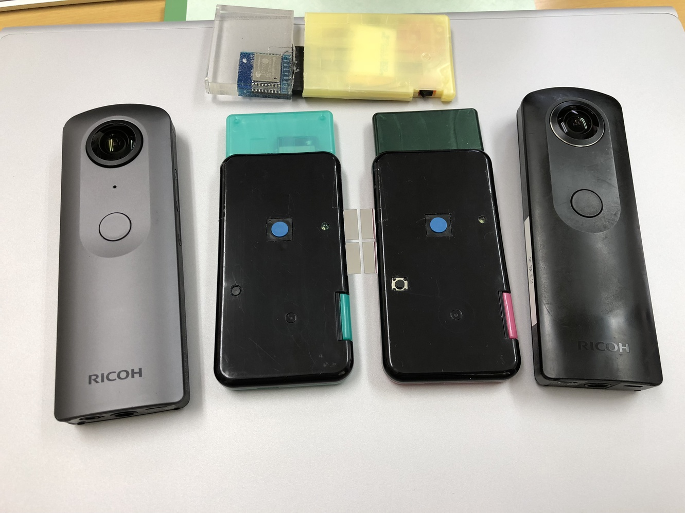
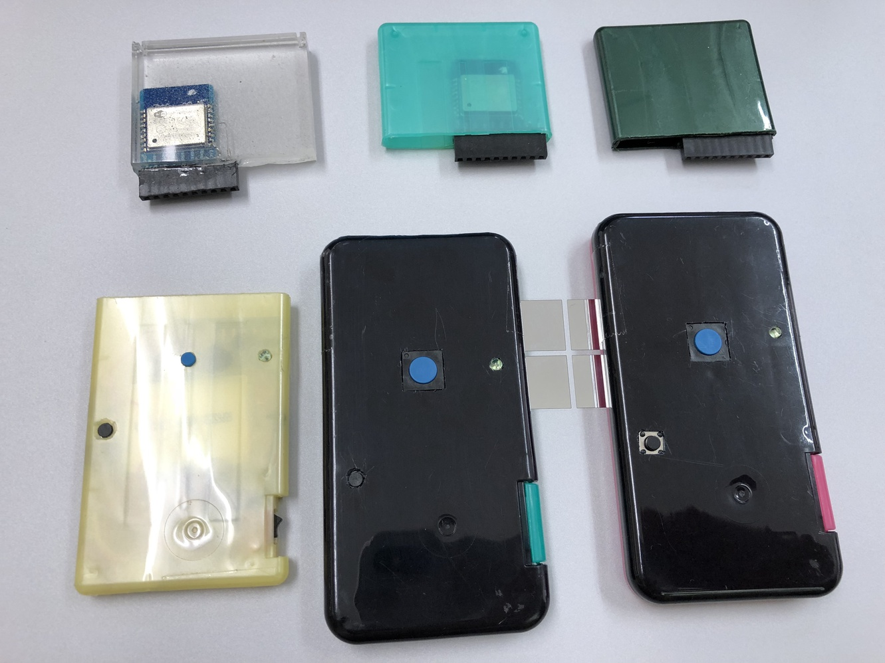
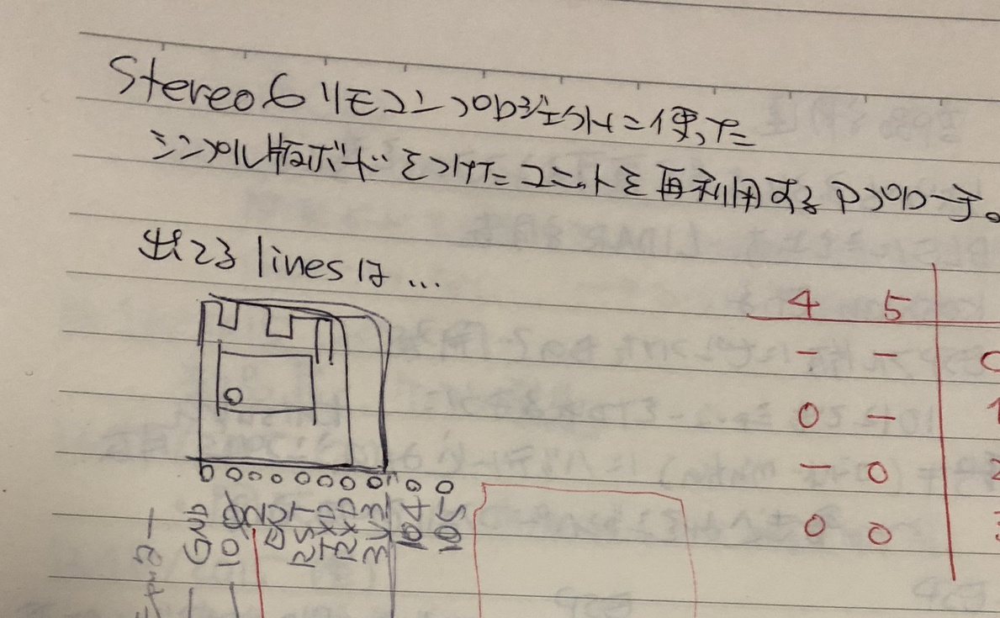
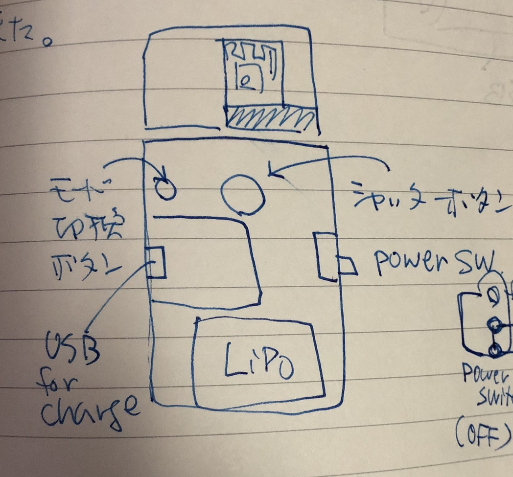
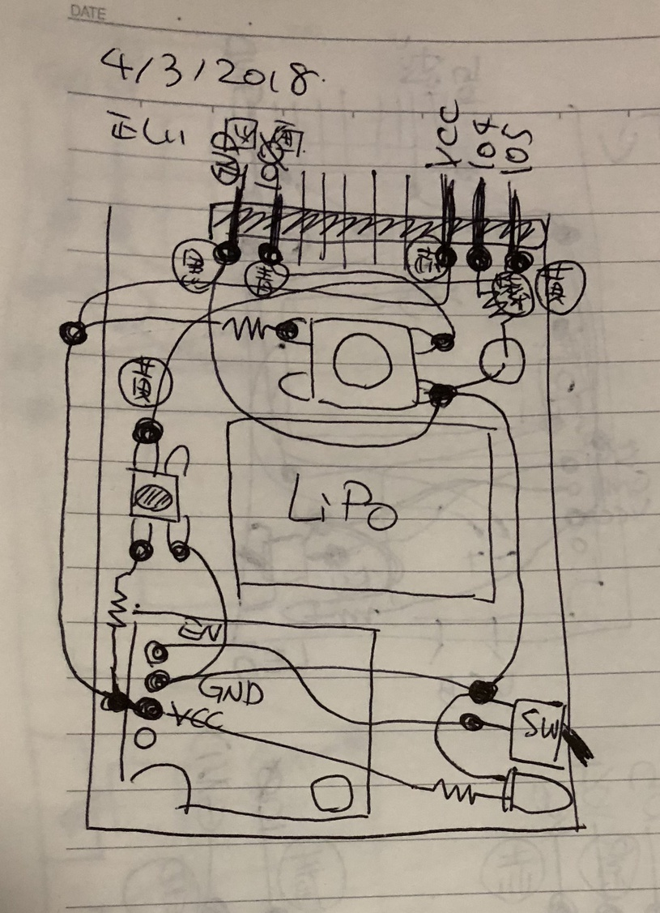

# ESP8266 (and ESP32) WiFi Remote for RICOH THETA S and V

forked from [katsuya-san/ESP8266-THETA-S-SimpleRemoteControler](https://github.com/katsuya-san/ESP8266-THETA-S-SimpleRemoteControler)

Please refer to the [original sketch](https://github.com/katsuya-san/ESP8266-THETA-S-SimpleRemoteControler) for details.

## Changes

* adapted for [RICOH THETA API v2.1](https://developers.theta360.com/en/docs/v2.1/api_reference/)
    * [original sketch](https://github.com/katsuya-san/ESP8266-THETA-S-SimpleRemoteControler) supports only [RICOH THETA API v2.0](https://developers.theta360.com/en/docs/v2.0/api_reference/)
* modified the interface with two buttons and one LED
    * [original sketch](https://github.com/katsuya-san/ESP8266-THETA-S-SimpleRemoteControler) supports only [RICOH THETA API v2.0](https://developers.theta360.com/en/docs/v2.0/api_reference/) is for one button-two LED setting

## Parts

* [ESP-WROOM-02 Wi-Fiモジュール（フラッシュ2MB）](https://www.switch-science.com/catalog/2346/)
* [ESP-WROOM-02ピッチ変換用基板《シンプル版》 （基板のみ）](https://www.switch-science.com/catalog/2363/)
    * alternatively [ESP-WROOM-02ピッチ変換済みモジュール《シンプル版》](https://www.switch-science.com/catalog/2341/)
* [リチウムイオンポリマー電池400mAh](https://www.switch-science.com/catalog/3118/)
* [Power Cell LiPo電池充電器](https://www.switch-science.com/catalog/1007/)

